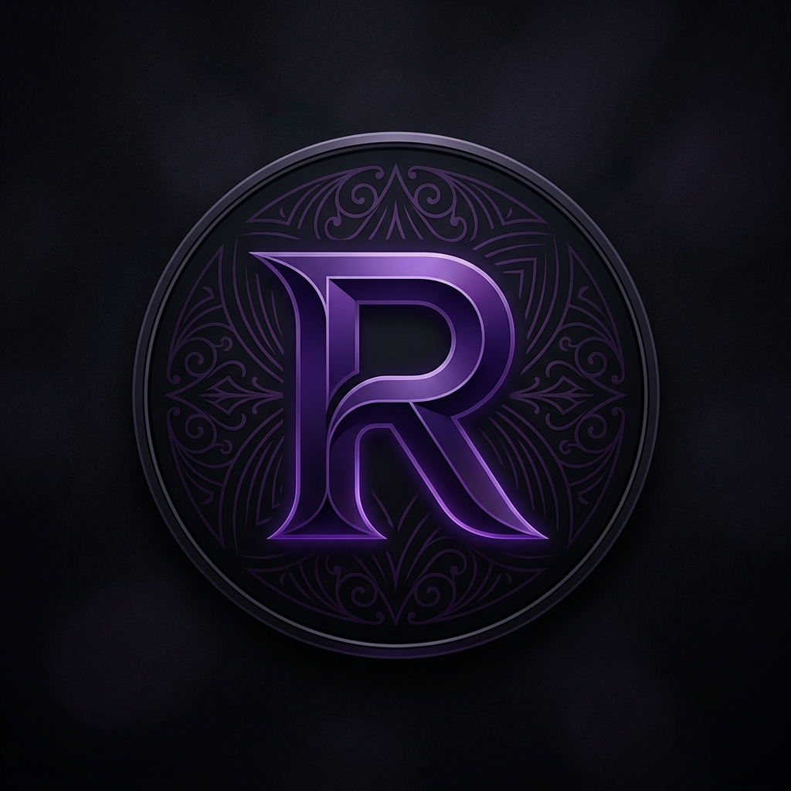

# 🚀 Ripleytia AI Cover V2 (Beta) - Büyük Güncelleme!

Uzun bir aradan sonra, yapay zeka müzik işleme deneyimini tamamen baştan yazarak **V2 (Beta)** sürümü ile karşınızdayız. Eski versiyondaki tüm sorunları çözmekle kalmadık, uygulamayı profesyonel bir stüdyo yazılımına dönüştürdük! 

Aşağıdan tek tıklamalı **Setup (Kurulum)** dosyasını indirerek yeni döneme katılabilirsiniz.

---

## 🌟 V2 (Beta) ile Gelen Yenilikler

*   🎨 **Tamamen Yeni Profesyonel Arayüz (UI):** "Ripleytia Gothic Purple-Dark" temasıyla artık göz yormayan, koyu ve çok daha profesyonel bir görünüme sahip. Logolar ve menüler baştan tasarlandı.
*   🧠 **Gelişmiş UVR5 Modeli Desteği:** Artık vokalleri ayırırken hangi UVR5 yapay zeka modelini (`UVR-MDX-NET-Voc_FT`, `KARA` vb.) kullanacağınızı arayüzden bizzat seçebilirsiniz. 
*   🚫 **Orijinal Sesin Sızmasına Son (Mute Backup Vocals):** Eski sürümde olan, şarkının orijinal sanatçısının sesinin yankı olarak arkadan gelmesi (Backup Vokal sızıntısı) sorunu tamamen çözüldü!
*   🎛️ **Vocal Rescue Chain (Vokal Kurtarma Zinciri):** Yapay zeka coverlarında ritmi ve kelimeleri bozan "aşırı yankılı şarkılar" için geliştirilmiş **3 aşamalı** devrimsel bir algoritma eklendi:
    - **Highpass Filter:** Çamurlu alt frekans yankılarını temizler.
    - **Noise Gate:** Yankı kuyruklarını saniyesi saniyesine keserek robotikleşmeyi önler.
    - **Compressor:** Tüm kelimelerin ses düzeyini dengeler.
*   📊 **Canlı Log Konsolu:** Arka planda açılan karmaşık CMD pencerelerine son! Uygulamanın en altında, anlık durumu gösteren canlı bir log konsolu var.
*   💾 **Ayarları Kaydetme & İçe Aktarma:** "Ayarları Kaydet" butonu sayesinde; Pitch, Reverb, Noise Gate eşiği gibi sizin için en mükemmel olan değerleri kaydedin.
*   🇹🇷 / 🇬🇧 **Çift Dil Desteği:** Sağ üst köşedeki butonla anında Türkçe ve İngilizce arasında geçiş yapabilirsiniz.
*   📁 **Özel Çıktı Klasörü:** Çıktıların nereye kaydedileceğini uygulama içinden "Klasör Seç" butonuyla siz belirleyin.
*   ⚡ **Tek Tıkla Otomatik Kurulum (Setup):** CUDA (Nvidia GPU), Pytorch ve diğer tüm kütüphaneler Setup dosyası tarafından otomatik kurulur.

---

## 📥 İndirme ve Kurulum

1. Aşağıdaki **Assets** bölümünden `Ripleytia AI Cover V2 Beta Setup.exe` dosyasını indirin.
2. Programı çalıştırın ve kurmak istediğiniz dizini (örneğin Masaüstü) seçip `Install` butonuna basın.
3. Arşivden çıkarma işlemi bittikten sonra ekranda siyah bir CMD penceresi (Kurulum Ekranı) açılacaktır. 
   *(Gerekli kütüphaneler ve modeller indirilecektir, internet hızınıza göre birkaç dakika sürebilir. Kapanmasını bekleyin.)*
4. Masaüstünüze gelen **Ripleytia AI Cover V2** logolu kısayola çift tıklayarak profesyonel uygulamanızı hemen kullanmaya başlayabilirsiniz!

*(Not: Kurulumun başlayabilmesi için bilgisayarınızda [Python 3.10](https://www.python.org/downloads/) yüklü olması ve "Add Python to PATH" işaretli olması gerekmektedir.)*

